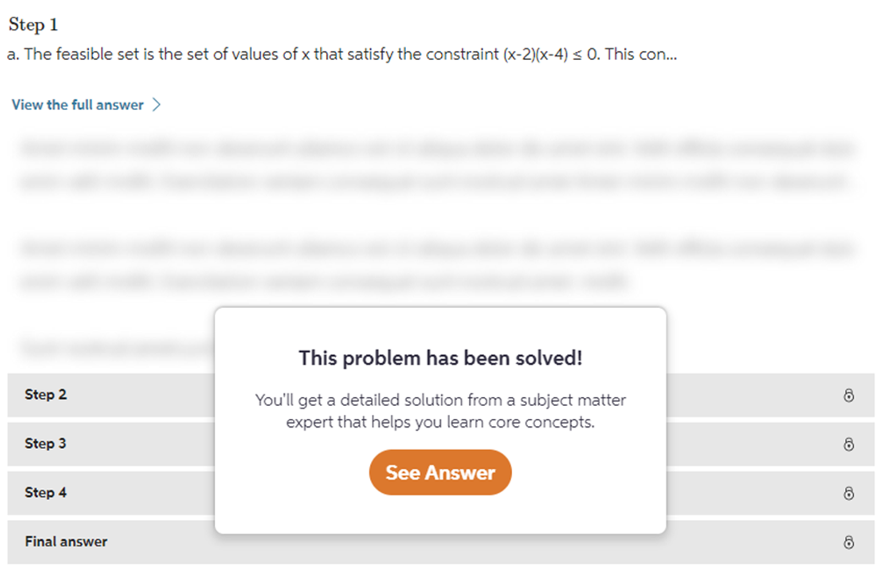
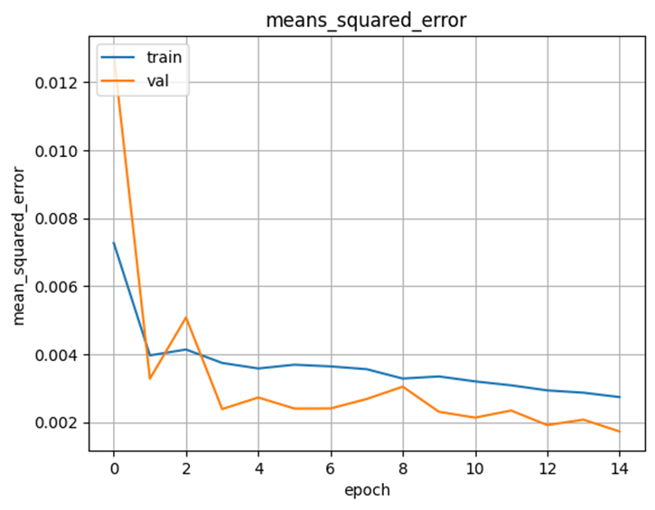
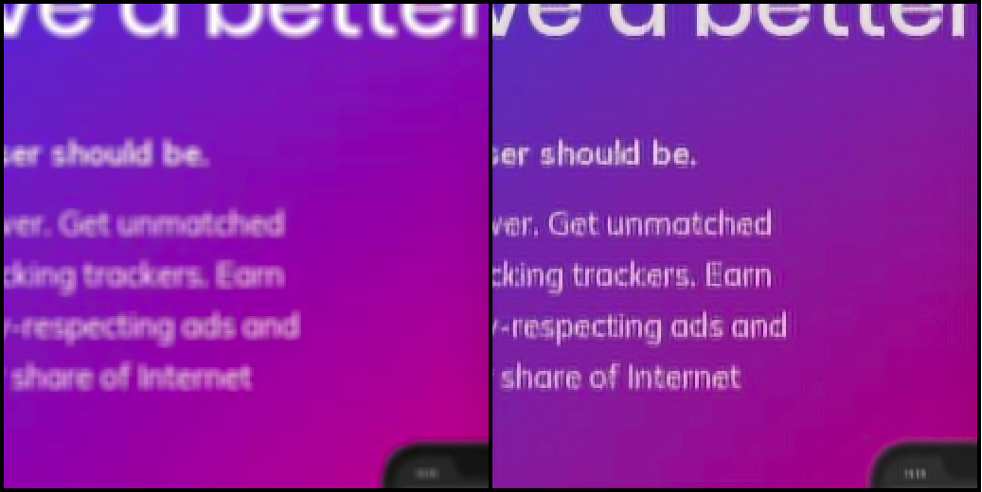

# 모자이크를 없애보자

📢 **2023년 여름학기 [AIKU](https://github.com/AIKU-Official) 활동으로 진행한 프로젝트입니다**
🎉 **(예시) 2023년 2학기 AIKU Conference 열심히상 수상!**

## 소개

텍스트 블러링은 웹사이트에서 사생활과 정보를 보호하고 호기심을 유발하는 데에 주로 사용되는 이미지 변형 기법입니다. 최근 딥러닝 모델은 이미지 식별, 이미지 변형, 이미지 생성 등 다양한 컴퓨터 비전 태스크에서 놀라운 성능을 보여주며 이미지 공간에 대한 수준 높은 이해도를 가지고 있음을 증명하였습니다. 안티에이징 (Anti-Aging) 모델은 이러한 이미지 공간의 이해를 바탕으로 블러 처리된 텍스트를 복원합니다.



## 방법론

- 딥러닝 모델의 훈련을 통해 블러 처리된 디지털 텍스트를 복원해내는 것을 목표로 합니다.
- [Website Screenshots](https://public.roboflow.com/object-detection/website-screenshots) 데이터셋을 활용하여 블러 처리된 이미지와 원래 이미지를 한 쌍으로 하는 데이터셋을 구축하였습니다. 블러링 기법의 경우, 가우시안 블러 (Gaussian blur), 박스 블러 (Box blur), 모션 블러 (Motion blur) 중에서 웹사이트에서 텍스트를 부드럽게 지우는데에 쓰이는 가우시안 블러링 기법을 선택하였습니다.
  
- Depix, BANet, Stripformer, U-Net 과 같은 여러 딥러닝 모델을 시도한 끝에 U-Net 모델을 활용하기로 결정하였습니다. U-Net 은 본래 이미지 세그멘테이션에 활용하는 모델이지만, 입력과 출력의 채널 수를 3으로 설정하여 이미지를 입력받고 출력할 수 있습니다.
- **Model 1. Attention R2U-Net** Attention R2U-Net 은 두 개의 최신 모델인 Attention U-Net 과 R2U-Net 을 결합한 모델입니다. 해당 모델로 블러 처리된 이미지와 실제 이미지 간의 차이를 예측하는 잔차 예측 (Residual prediction) 을 통해 이미지 공간을 모델링하는 부담을 줄이고 텍스트 디블러링에만 집중할 수 있도록 하였습니다.
  
- **Model 2. Robust U-Net** Robust U-Net 은 U-Net 모델 구조를 바탕으로 다운샘플링 단계의 마지막에 tensor addition 계층을 추가한 모델입니다. 입력 텐서와 출력 텐서를 더함으로써 모델의 학습 능력이 향상되었습니다. 추가로 이미지 생성, Super resolution 에서 사용되는 손실 함수인 Perceptual loss 를 사용하였습니다.
  

## 환경 설정

### Requirements

- Python >= 3.8.5
- PyTorch
- Keras

### Anaconda

```bash
conda create -n antiaging python=3.10
conda activate antiaging
pip install -r requirements.txt
```

## 사용 방법

- Model 1. Attention R2U-Net

  ```bash
  cd attnr2u
  python main.py
  ```

- Model 2. Robust U-Net

  ```bash
  cd robustu
  python eval_model.py --data_dir data/ --ckpt checkpoints/robustu_checkpoint.ckpt
  ```

## 예시 결과

- Model 1. Attention R2U-Net (왼쪽이 블러 처리된 입력 이미지, 오른쪽이 예측한 이미지)
  

- Model 2. Robust U-Net (각 열에서, 왼쪽이 블러 처리된 입력 이미지, 오른쪽이 예측한 이미지)
  

## 팀원

- [구은아](https://github.com/AIKU-Official/anti-aging/commits?author=eunai9): 팀장, Robust U-Net 버전 개발, 데모 구현
- [김승현](https://github.com/hijihyo): 데이터셋 탐색, Attention R2U-Net 버전 개발
- 진시윤: Attention Gate U-Net 버전 개발, 발표 자료 제작
