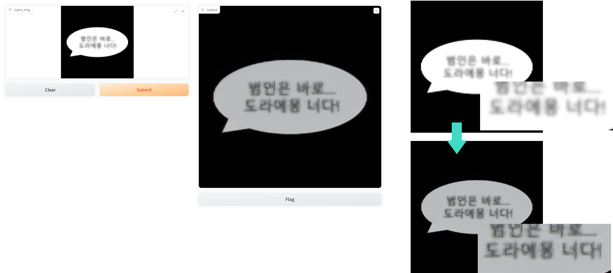

# anti-aging

AIKU 2023-Summer Project: Anti-Aging

## 1. Introduction


- 웹사이트에 존재하는 블러 처리되어 있는 텍스트의 대표적인 예시.
- 블러 처리되어 있는 text 이미지를 복원하는 모델을 만드는 것이 목표.
- 해당 모델을 구축한 이후, 실제로 사용할 수 있도록 데모 사이트 완성하는 것이 최종 목표.

## 2. Dataset


- 웹사이트에 존재하는 blurred text image를 필요로 하기 때문에 웹사이트의 전체 스크린샷에서 bounding box로 각 요소를 추출한 데이터셋인 Website Screenshots dataset 사용.
- 본문 뿐만 아니라 로고, 버튼 등 다양한 데이터가 존재하며, 영어 외에도 중국어, 일본어 등 다양한 언어도 존재한다.
- Data preprocessing
  - input size $256\times 256$에 맞춰, cropped image를 중앙에 두고, 사방에 검은색으로 빈 공간을 채워 넣어 sharp dataset 생성.
  - sharp dataset에 Gaussian blur 레이어를 적용하여 blur dataset 생성
    - Why Gaussian Blur?
      - Gaussian blur :  Gaussian distribution 갖는 커널을 적용한 블러. 분포함수처럼 커널의 가운데 값이 크고 중앙에서 멀어질수록 값이 작아지는 양상을 보임.
      - Box blur : box 형태로 이미지를 블러처리. (~모자이크 픽셀)
      - Motion blur : 이미지가 특정 방향으로 움직이는 것과 같은 효과를 주는 블러.
      - ⇒ 우리가 해결하고자 하는 task는 대체로 가우시안 블러된 이미지를 목적으로 함.


## 3. Attempts

1. Depix

   - Search image를 참고하여 복원, 존재하지 않을 경우 복원 불가. -> 높은 복잡도
   - 딥러닝 방식이 아님

2. BANet

   - Blur-aware attention 이용한 모델.
   - GoPro dataset으로 학습되어 real world 이미지에 대해서는 좋은 성능.
   - 그러나 text dataset에 대해서는 bad performance -> 우리 task에 적합하지 않음

3. StripFormer

   - Strip Transformer 이용한 모델.
   - BANet과 동일한 데이터셋으로 학습. 같은 문제점 발생. -> 우리 task에 적합하지 않음

## 4. Model

### Why U-Net?

- 이미지 세그멘테이션 모델은 (3, H, W) 이미지를 입력 받아 (C, H, W) 크기의 세그멘테이션 맵을 출력함
- C = 3 으로 설정하면 세그멘테이션 맵을 RGB 이미지로 볼 수 있음


- 사실 디퓨전 모델에서 비슷한 방식으로 활용되고 있음
- 이미지를 입력 받아 이미지 형태의 노이즈를 예측하는 Denoising U-Net


### Attention Gate U-Net


- 전반적인 UNet 구조를 따름.
- 그러나, skip connection를 지나온 feature들을 필터링하기 위해 Attention Gates들을 추가.

### Model 1 : Attention R2U-Net (Pytorch)

- Attention U-Net + R2U-Net → 두 개의 최신 연구를 통합함


- 실험 환경
  - 가우시안 블러 (`kernel_size=5`, `sigma=3.0`) 로 해상도를 낮춤
  - 이미지를 $256\times256$ 크기로 통일하기 위해 `RandomResizedCrop`와 `CenterCrop`을 활용함
  - AdamW (`lr=1e-3`) 로 9,000 스텝 동안 학습함 (`batch_size=16`)


- 훈련 결과


훈련 세트에서 가져온 이미지 샘플 (왼쪽은 입력, 오른쪽은 예측본)


검증 세트에서 가져온 이미지 샘플 (왼쪽은 입력, 오른쪽은 예측본)

### Model 2 : Robust U-Net (Keras)

#### Architecture


- 기본적으로 downsampling과 upsampling을 순차적으로 진행하는 U-Net 구조를 가짐
- downsampling 단계에서 convolution, normalization, activation(ReLU) 끝에 tensor addition 레이어 추가
  - 처음 residual block에 input되었던 tensor와 residual block을 통과한 output tensor를 더하는 과정
  - 복잡한 구조의 네트워크에 도움

#### padding


- 모델의 input size인 256 맞추어 crop image의 사방에 검은색으로 빈 공간을 채움

#### perceptual loss


- image generation, super resolution에 사용되는 loss function
- RGB image 간 pixel-wise distance를 측정하는 것이 아닌, feature space 상에서 loss를 측정
- VGG16을 사용하여 feature space 추출

#### Train

- 15 epoch
- perceptual loss
- Adam (learning rate = 0.001)


- 최종 train loss: 0.4938
- 최종 validation loss: 0.4592

#### Results

- 왼쪽이 output, 오른쪽이 blurred text


- 텍스트를 이루는 선이 선명해짐
- 다양한 언어에 대해 성능이 일정

초기에 생각했던 것은 훨씬 강한 블러 처리된 텍스트로부터 원래 텍스트를 복원하는 것이었으나 모델을 학습시키는 과정에서 너무 강한 블러는 제거하기 어렵다는 것을 판단. 최종적으로 만들어진 모델은 텍스트의 흐릿한 선을 어느정도 선명하게 만드는 느낌의 성능을 보임. 이것이 마치 노안때문에 잘 안 보이는 텍스트를 선명하게 보이도록 만드는 것과 비슷하여 모델의 이름을 ‘Anti-aging’으로 정하게 되었다.

## 5. Demo

- Gradio 사용

1. Model 1

    ```python
    import gradio as gr
    from antiaging_pytorch_inference import deblur
    import torchvision
    from torchvision.transforms import functional as TF
    import numpy as np
    
    def antiaging_pytorch(input_img):
        input_img = TF.center_crop(input_img, (256, 256))
        input_img = TF.to_tensor(input_img)
        input_img = TF.normalize(input_img, (0.5, 0.5, 0.5), (0.5, 0.5, 0.5))
        output = deblur(input_img)
        output = np.array(torchvision.utils.make_grid([input_img, output], nrow=2, normalize=True).permute(1,2,0))
        return output
    
    demo = gr.Interface(antiaging_pytorch, gr.Image(type="pil"), gr.Image(type="numpy"))
    demo.launch()
    ```

    

2. Model 2

    ```python
        import gradio as gr
        import antiaging_keras_load
        import numpy as np
        
        def antiaging_keras(input_img):
            aag_k = antiaging_keras_load.load_model("runet_ckpt_0830_132714")
            input_img = antiaging_keras_load.prepare_image(input_img)
            output = aag_k(np.expand_dims(input_img, axis=0))
            output = np.squeeze(output)
            output = np.array(abs(output), np.float32)/255.
            return output
        
        demo = gr.Interface(antiaging_keras, gr.Image(type="numpy"), gr.Image(type="numpy"))
        demo.launch()
    ```

    

## Appendix

- [Link to the dataset file used to train the model 1](https://drive.google.com/file/d/1brHeCW8qHle0Vkp_fh16w4h-696QIAod/view?usp=sharing)
- [Link to the checkpoint file of the model 1](https://drive.google.com/file/d/19VMJw6pBUDMWp14kM4qOiuLqfk1mQlKB/view?usp=sharing)
